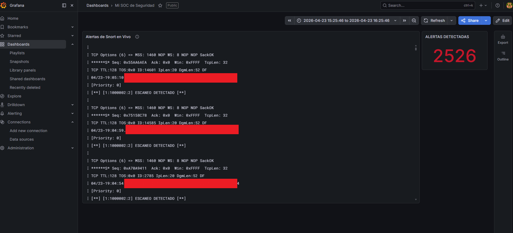

# 🛡️ Advanced SOC Infrastructure & Active IDS Monitoring - LMTM

### 👤 Autor
**Luz Maria Talavera Martinez**  
**Fecha:** 23 de abril de 2026

---

### 🌟 Visión General
Este proyecto representa el despliegue completo de un **Centro de Operaciones de Seguridad (SOC)** escalable, diseñado para entornos de alta eficiencia. El sistema es capaz de capturar, analizar, almacenar y visualizar amenazas de red en tiempo real, integrando herramientas líderes en la industria de la ciberseguridad.

Este desarrollo fue realizado siguiendo una metodología de colaboración avanzada entre **Ingeniería Humana + Inteligencia Artificial**, permitiendo la optimización de arquitecturas YAML, la depuración de reglas de Snort y el diseño de consultas LogQL complejas en tiempo récord.

---

### 🛠️ El Stack Tecnológico (The Data Pipeline)
El flujo de datos sigue un proceso de ingeniería de logs preciso:

1.  **Detección (Snort IDS):** Motor de análisis configurado en modo NIDS para identificar patrones de ataques como Escaneos de Puertos, ICMP Flooding y Bad Traffic.
2.  **Captura Forense (Wireshark/Dumpcap):** Implementación de una "Tubería Remota" vía SSH que permite visualizar en Windows el tráfico crudo capturado en el servidor Linux en tiempo real.
3.  **Transporte (Promtail):** Agente ligero que monitorea los archivos de alerta de Snort, los etiqueta y los transmite sin pérdida de datos.
4.  **Indexación (Grafana Loki):** Base de datos optimizada para logs que permite búsquedas de alta velocidad con bajo consumo de recursos.
5.  **Visualización (Grafana Dashboard):** Un panel de control personalizado con:
    *   **Contador de Alertas Críticas:** Visualización tipo *Stat* en rojo para respuesta inmediata (con más de 4,000 eventos detectados en pruebas de carga).
    *   **Visualizador de Logs en Vivo:** Streaming de alertas con detalles técnicos de IP origen/destino.

---

### 📊 Desafíos de Ingeniería Superados
*   **Optimización de Recursos (8GB RAM):** El sistema fue diseñado para correr en hardware limitado. Se optimizaron los tiempos de refresco de Grafana (10s) y el rango de retención de Loki para evitar saturación de memoria.
*   **Conectividad Multi-Plataforma:** Configuración exitosa de túneles SSH para desacoplar la captura de datos (Linux) del análisis visual (Windows/Wireshark).
*   **Normalización de Datos:** Uso de expresiones regulares (Regex) en Grafana para extraer IPs y mensajes de alerta desde texto plano no estructurado.

---

### 📂 Estructura del Repositorio
*   `configs/`: Configuraciones maestras de Loki y Promtail (YAML).
*   `dashboards/`: El modelo JSON del Dashboard profesional.
*   `rules/`: Reglas de detección personalizadas para Snort.
*   `scripts/`: Scripts Bash para automatizar la descarga de binarios y el inicio del stack.

---

### 🚀 Cómo Replicar este SOC
1.  **Instalar Binarios:** `bash scripts/install_stack.sh`
2.  **Iniciar Servicios:**
    *   `./loki -config.file=configs/loki-config.yaml`
    *   `sudo ./promtail -config.file=configs/promtail-config.yaml`
3.  **Correr Snort:** `sudo snort -A full -c /etc/snort/snort.conf -i enp0s8`
4.  **Importar Dashboard:** Carga el archivo en `dashboards/soc-dashboard.json` en tu instancia de Grafana.

---
**Desarrollado con precisión por Luz Maria Talavera Martinez** | *Defendiendo la red, un paquete a la vez.* 🛡️✨
