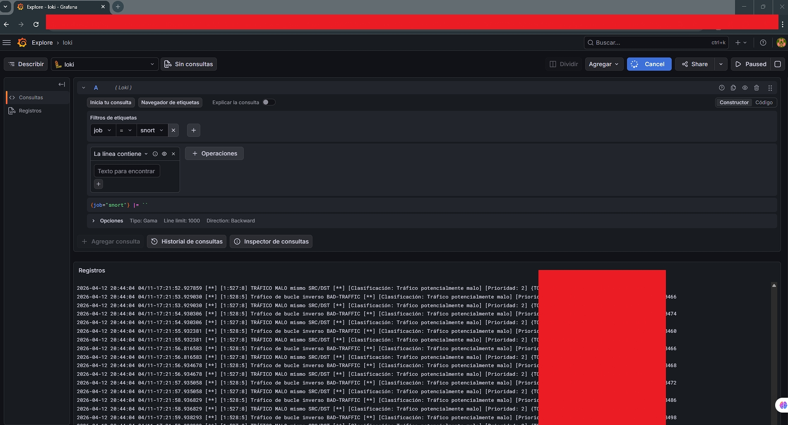

# 🛡️ LMTM: SOC Active Monitoring & IPS Engine

**Desarrollado por:** Luz Maria Talavera Martinez  
**Fecha:** 12 de Abril, 2026

## 📝 Descripción
Este repositorio es una solución integral de **Defensa Activa y Observabilidad**. Combina un motor de respuesta ante intrusiones (IPS) desarrollado en Python con un stack de monitoreo moderno (Grafana + Loki) para la visualización de incidentes en tiempo real.

## 📊 Monitoreo en Tiempo Real

*Evidencia del SOC Panel visualizando bloqueos automáticos.*

## 📂 Estructura del Proyecto

### 🤖 /automation (Motores y Scripts)
*   **`ips_lmtm.py`**: El cerebro del sistema. Coordina la lectura de logs y activa las acciones de defensa.
*   **`bloqueador.py`**: Módulo especializado en la gestión de reglas de Firewall (IPTables) para mitigar ataques.
*   **`monitor_snort.py`**: Analizador de alertas en tiempo real basado en firmas de Snort.
*   **`iniciar_soc.sh`**: Script de orquestación en Bash para levantar toda la infraestructura de monitoreo con un solo comando.

### ⚙️ /configs
*   Archivos YAML de configuración para **Loki** y **Promtail**, optimizados para bajo consumo de recursos (8GB RAM).

---
> **Metodología:** Proyecto ejecutado íntegramente por **Luz Maria Talavera Martinez**. Se utilizó IA como mentor estratégico para optimizar el flujo de datos y asegurar las mejores prácticas en documentación técnica.
