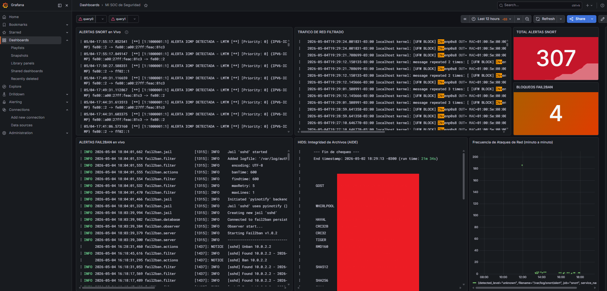

# 🛡️ Advanced SOC Infrastructure & Active IDS Monitoring - LMTM 2.0

### 👤 Autor: **Luz Maria Talavera Martinez**
**Fecha:** 2 de mayo de 2026 (Actualizado)  
**Especialidad:** Ciberseguridad & Automatización de Infraestructuras

---



## 🌟 Visión General del Proyecto
Este ecosistema representa la evolución de un IDS tradicional hacia un **Centro de Operaciones de Seguridad (SOC)** proactivo. Procesa la telemetría de seguridad en múltiples dimensiones para ofrecer visibilidad total sobre la superficie de ataque de un servidor Linux.

El desarrollo ha sido optimizado mediante una metodología de **Co-Diseño Humano + IA**, logrando una arquitectura de datos resiliente capaz de operar en hardware optimizado (4GB/8GB RAM).

---

## 🛠️ Arquitectura del SOC (Defensa en Profundidad)

### 1. NIDS (Snort 2.9.x)
*   **Capacidad:** Análisis de protocolos en tiempo real y detección de firmas maliciosas (DPI).
*   **Modo Operativo:** Configurado en **Modo Promiscuo** para inspección total de red.

### 2. IPS (Fail2ban)
*   **Capacidad:** Respuesta activa ante incidentes.
*   **Acción:** Correlación de logs de autenticación para baneo automático de IPs sospechosas.

### 3. HIDS (AIDE)
*   **Capacidad:** Auditoría de integridad de archivos (Host-based).
*   **Automatización:** Implementación de **Cron Jobs** para reportes diarios de integridad en directorios críticos (/etc, /bin, /usr/bin).

### 4. Hardening Audit (Lynis)
*   **Métrica:** Sistema auditado y securizado con un **Hardening Index de 82/100**.
*   **Cumplimiento:** Implementación de banners legales y gestión de excepciones técnicas documentadas.

---

## 🚀 Ingeniería de Automatización (The SOC Pipeline)

*   **Pipeline de Telemetría (PLG Stack):**
    *   **Promtail:** Agente de transporte de logs (Snort, AIDE, Fail2ban).
    *   **Loki:** Almacén de logs de alta eficiencia indexado por etiquetas.
    *   **Grafana:** Motor de visualización analítica y alertas.

*   **Scripts de Integridad (check_aide.sh):** Automatización que centraliza hallazgos de AIDE directamente en el pipeline de logs.

---

## 📂 Estructura del Ecosistema
```text
├── config/           # Configuraciones YAML (Promtail, Docker, Lynis)
├── dashboards/       # ADN Visual (Modelos JSON de Grafana)
├── docs/             # Reportes de auditoría y bitácoras técnicas
├── scripts/          # Automatización (Instalación, AIDE, Inicio)
└── deploy.sh         # Script maestro de despliegue rápido
```

---

## ⚙️ Despliegue en 3 Pasos (Docker-Ready)

1.  **Instalación:**
    `sudo ./deploy.sh`
2.  **Inicialización HIDS:**
    `sudo aide --init --config ./config/aide.conf`
3.  **Visualización:**
    Acceder a http://localhost:3000 e importar `dashboards/soc_v2.json`.

---

## 🐳 Infraestructura SOC 2.0 (Docker Edition)

### Gestión del Stack Visual
```bash
# Levantar Loki, Grafana y Promtail con un solo comando
sudo docker-compose -f ./config/docker-compose.yml up -d
```

---

**"La seguridad no es un producto, es un proceso automatizado."**  
**Desarrollado con precisión por Luz Maria Talavera Martinez** | *Defensa Proactiva.* 🛡️✨
