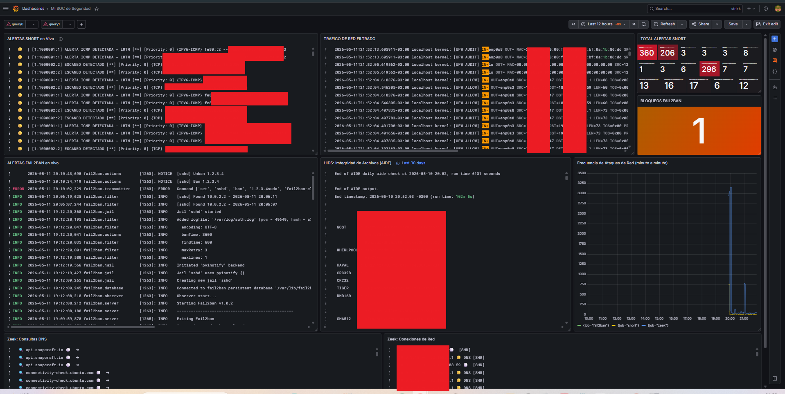

# 🛡️ Advanced SOC Infrastructure & Active IDS Monitoring - LMTM 2.0

### 👤 Autor: **Luz Maria Talavera Martinez**
**Fecha:** 11 de mayo de 2026 (Actualización: Integración NIDS Zeek)
**Especialidad:** Ciberseguridad & Automatización de Infraestructuras

---



## 🌟 Visión General del Proyecto
Este ecosistema representa la evolución de un IDS tradicional hacia un **Centro de Operaciones de Seguridad (SOC)** proactivo. Procesa la telemetría de seguridad en múltiples dimensiones para ofrecer visibilidad total sobre la superficie de ataque de un servidor Linux, integrando ahora análisis profundo de protocolos.

---

## 🛠️ Arquitectura del SOC (Defensa en Profundidad)

### 1. NIDS Híbrido (Snort + Zeek)
*   **Snort (2.9.x):** Detección de intrusiones basada en firmas y reglas en tiempo real.
*   **Zeek (v6.0+):** Análisis de red profundo (Network Security Monitoring). Procesa protocolos (DNS, SSL/TLS, TCP) y genera telemetría estructurada en JSON para análisis forense.

### 2. IPS (Fail2ban)
*   **Capacidad:** Respuesta activa ante incidentes, detección de fuerza bruta y baneo automático de IPs maliciosas.

### 3. HIDS (AIDE)
*   **Capacidad:** Auditoría de integridad de archivos. Detecta modificaciones no autorizadas en binarios y archivos de configuración críticos.

### 4. Hardening Audit & Compliance (Lynis)
*   **Métrica:** Sistema securizado con un **Hardening Index de 83/100**.
*   **Defensa Proactiva:** Kernel protegido con **Livepatch** y suscripción **Ubuntu Pro** activa hasta 2036.

---

## 🚀 Ingeniería de Automatización (The SOC Pipeline)

*   **Pipeline de Telemetría (PLG Stack):**
    *   **Promtail:** Agente de transporte que recolecta logs de Snort, Zeek, Fail2ban y UFW.
    *   **Loki:** Almacén de logs indexado por etiquetas para consultas de alta velocidad.
    *   **Grafana:** Panel de control centralizado con visualización analítica, iconos de prioridad y filtrado dinámico.

*   **Ingestión de Datos:** Configuración de Zeek mediante `local.zeek` para salida JSON nativa, garantizando una integración fluida con el stack de visualización.

---

## ⚙️ Despliegue Robusto (Quick Start)

1.  **Instalación de Componentes:**
    `sudo ./deploy.sh`
    *(Instalación de Snort, Fail2ban y dependencias de red).*

2.  **Configuración de Zeek (NIDS):**
    Asegurar que Zeek esté en `/opt/zeek` y ejecutar:
    `sudo /opt/zeek/bin/zeekctl deploy`

3.  **Visualización (Docker Stack):**
    `cd config && sudo docker compose up -d`
    Acceder a `http://localhost:3000` e importar `dashboards/soc_v2.json`.

---

## 📂 Estructura del Ecosistema
```text
├── config/           # Configuraciones YAML (Promtail, Docker, Loki)
├── dashboards/       # ADN Visual (Modelo SOC v2.0 optimizado con Zeek)
├── docs/             # Bitácora técnica y reportes de auditoría
├── img/              # Capturas del entorno (soc_final_lmtm.png)
├── deploy.sh         # Script maestro de despliegue
```

---

**"La seguridad no es un producto, es un proceso automatizado."**
**Desarrollado con precisión por Luz Maria Talavera Martinez** | *Defensa Proactiva.* 🛡️✨
