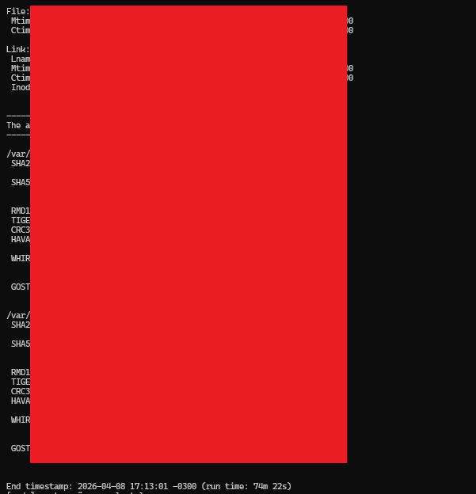
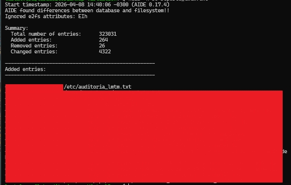

# 🛡️ Informe de Auditoría de Integridad (HIDS) - Ecosistema LMTM

**Autor:** Luz Maria Talavera Martinez  
**Fecha:** 8 de Abril de 2026  
**Proyecto:** Implementación de Monitoreo de Integridad con AIDE  
**Clasificación:** Documentación de Hardening de Infraestructura  

---

### 📝 Resumen Ejecutivo
Este laboratorio documenta la implementación de un Sistema de Detección de Intrusos basado en Host (**HIDS**) utilizando la herramienta **AIDE** (Advanced Intrusion Detection Environment). El objetivo principal fue establecer una línea base de seguridad post-hardening para garantizar la inmutabilidad de los archivos críticos del sistema y la detección temprana de intrusiones.

### 🚀 Hitos Técnicos y Métricas
- **Reducción de Superficie de Ataque:** Auditoría previa con **Nmap** para la identificación y cierre del puerto `631 (CUPS)`, eliminando servicios innecesarios antes de la generación de firmas.
- **Línea Base de Seguridad (Baseline):** Generación exitosa de firmas criptográficas para **323,031 entradas** del sistema.
- **Criptografía Multicapa:** Configuración de monitoreo con algoritmos de alta fidelidad: `SHA-512`, `Whirlpool`, `RMD160`, `TIGER` y `GOST`.
- **Validación Forense:** Identificación y aislamiento exitoso de una inyección manual de archivos en el directorio `/etc/` entre un volumen de más de 4,000 cambios legítimos del sistema.

### 🛠️ Resolución de Desafíos (Troubleshooting)
Como perfil **Trainee**, el desarrollo de este proyecto implicó la resolución de retos técnicos reales:
- **Gestión de Base de Datos:** Resolución de discrepancias en la extensión de la base de datos (`.new` vs `.gz`) mediante gestión manual de rutas para la activación del servicio.
- **Análisis de Big Data en Logs:** Implementación de filtros avanzados (`grep`, `head`, `less`) para la interpretación de reportes masivos, logrando distinguir actividad del sistema de posibles anomalías.
- **Metodología de Aprendizaje:** El proyecto fue ejecutado bajo la mentoría técnica de inteligencia artificial, asegurando la adopción de estándares industriales y la transparencia total en la ejecución de comandos.

### 📊 Evidencias de Laboratorio

**Figura 1:** *Reporte de hashes criptográficos y tiempos de ejecución del escaneo de integridad.*

**Figura 2:** *Resumen ejecutivo de auditoría y validación de inyección de archivos en directorios críticos.*

*(Consultar archivos en la carpeta `/img`)*
1. **Initial Baseline:** Registro del escaneo de las 323,031 entradas.
2. **Integrity Alert:** Captura del reporte detallado confirmando la detección del archivo intruso (`Added entries: 1`).

### 📂 Estructura del Repositorio
- `/scripts`: Scripts de automatización para auditorías programadas.
- `/img`: Evidencias gráficas del proceso y resultados.

---
*Este laboratorio reafirma mi compromiso con el aprendizaje continuo y la transparencia técnica en el camino hacia la especialización en Ciberseguridad.*
